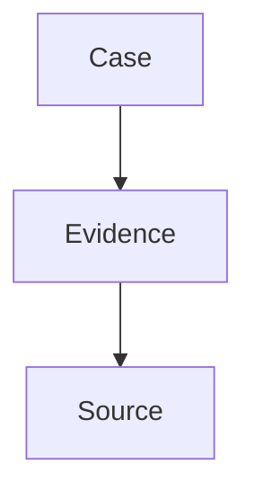

### `docs/export/AFFINE.md`
```markdown
# AFFiNE Export – Integration Guide

> Ziel: Inhalte aus InfoTerminal direkt in **AFFiNE** (Markdown + Edgeless Board) nutzen. Fokus: MD-Bundles, Graphen (Mermaid/DOT+SVG) und **Canvas via Excalidraw JSON**.

---

## ✅ TL;DR

- **Dossier-Bundle** (MD + Assets) → in AFFiNE importieren.
- **Edgeless Canvas**: `canvas.excalidraw.json` separat importieren; AFFiNE Edgeless kann Excalidraw-JSON verarbeiten (alternativ als Attachment + Preview).
- **Graphen**: Mermaid im MD + gerendertes SVG als Fallback.

---

## 📦 Bundle-Struktur (wie AppFlowy)

````

bundle/
index.md
assets/
figures/*.png|svg
graphs/graph.mmd | graph.dot | graph.svg
tables/*.csv
maps/\*.geojson
canvas.excalidraw\.json
meta/export.json

````

**Canvas-Verlinkung in `index.md`:**
```markdown
> Edgeless Board als Excalidraw: siehe `assets/canvas.excalidraw.json`
````

---

## 🖥️ Bedienung (Frontend)

* Button **„Export → AFFiNE“**
* Optionen:

  * Inhalte: *Dossier*, *Graph*, *Canvas (Edgeless)*, *Tabellen*
  * Formate: *md*, *svg*, *mermaid*, *dot*, *csv*, *geojson*, *excalidraw*
  * Ziel: *ZIP* oder *Watched Folder*
* Ergebnis: Pfad/Datei + Hashes + Hinweis zu Edgeless-Import.

---

## 🧰 CLI

```bash
# Dossier + Canvas für AFFiNE
it export dossier \
  --template docs/dossiers/disinfo_campaign_report.md.tmpl \
  --data cases/777.json \
  --target affine \
  --out out/affine_bundle.zip

# Nur Canvas als Excalidraw JSON
it export canvas --case 777 --format excalidraw --out out/affine/canvas.excalidraw.json
```

---

## 🔁 Watched-Folder

```yaml
watched_folders:
  affine: "/Users/<you>/AFFiNE/import"
```

---

## 🔌 (Optional) AFFiNE-Adapter/API

* `POST /documents` – Markdown-Seite erzeugen
* `POST /assets` – Dateien/Graphen/Canvas hochladen
* `POST /edgeless` – Excalidraw-JSON als Board importieren

> Falls keine API: Datei-Import bleibt der Standardweg.

---

## 🔒 Security & Governance

* Standard: **File-Export** (kein API-Zugriff).
* Export-Policy (OPA): `classification in ALLOWED_EXPORT_CLASSES`.
* Hashes/Provenienz (`meta/export.json`) für Revisionssicherheit.
* API-Adapter (falls aktiv): Secrets via **Vault**, Rate-Limits, Scopes.

---

## 🧪 Tests

* Golden Bundle + Roundtrip-Import
* Canvas-Validierung: Excalidraw JSON-Struktur
* Mermaid-Fallback via SVG im Markdown

````

---

### `docs/export/BUNDLE-SPEC.md`
```markdown
# Bundle Spec – InfoTerminal → AppFlowy/AFFiNE

## Ziel
Ein **portables, robustes Export-Format**, das in Notiz-/Dokument-Apps stabil importiert werden kann.

---

## Struktur

````

bundle/
index.md
assets/
figures/*.png|svg
graphs/graph.mmd
graphs/graph.dot
graphs/graph.svg
tables/*.csv
maps/\*.geojson
canvas.excalidraw\.json
meta/export.json

````

---

## `index.md` Richtlinien

- Front-Matter (YAML) aus Dossier-Templates beibehalten.
- Interne Links relativ: `assets/...`.
- Mermaid-Block **und** SVG-Fallback verlinken.

Beispiel:
```markdown
# Executive Summary
…

## Graph




---

## `meta/export.json` Felder

| Feld                 | Typ     | Beschreibung                                   |
|----------------------|---------|-----------------------------------------------|
| case_id              | string  | UUID/ID des Falls                              |
| exported_at          | string  | ISO-8601 Datum/Zeit                            |
| profile              | string  | Preset/Profil                                  |
| artifacts            | object  | Pfade zu Artefakten                            |
| hashes               | object  | SHA256 pro Datei                               |
| provenance.pipeline  | string  | NiFi/n8n Pipeline-ID                           |
| provenance.models    | string[]| verwendete Modelle/Versionen                   |
| request_id           | string  | X-Request-ID                                   |

---

## Validierung

- SHA256 aller Dateien
- JSON Schema für `meta/export.json` (optional)
- Golden Snapshot Tests (Markdown + Assets vorhanden)

---

## Kompatibilität

- **AppFlowy**: Import Markdown (Ordner/ZIP). Mermaid-Rendering optional → SVG-Fallback sichtbar.
- **AFFiNE**: Import Markdown + Excalidraw JSON für Edgeless; Dateien als Anhänge.
```

---

### **TODO-Index – Ergänzungen**

> Hänge diesen Block an `docs/TODO-Index.md` an.

```markdown
## 28. AppFlowy & AFFiNE Export/Integration
- [ ] **[EXPORT-1]** Bundle-Builder (md + assets + meta/export.json)
- [ ] **[EXPORT-2]** Graph-Exporter (mermaid.mmd, dot, svg)
- [ ] **[EXPORT-3]** Canvas-Exporter (excalidraw.json)
- [ ] **[EXPORT-4]** Geo-Exporter (geojson + map.png/svg)
- [ ] **[APPFLOWY-1]** AppFlowy Adapter – Watched Folder
- [ ] **[APPFLOWY-2]** AppFlowy Adapter – API Mode (optional)
- [ ] **[AFFINE-1]** AFFiNE Adapter – Watched Folder + Edgeless Import
- [ ] **[AFFINE-2]** AFFiNE Adapter – API Mode (optional)
- [ ] **[FE-EXPORT-1]** Frontend Export-Dialog (Targets + Formate)
- [ ] **[CLI-EXP-1]** CLI `it export dossier/graph/canvas`
- [ ] **[N8N-EXP-1]** n8n Nodes `export_to_appflowy` / `export_to_affine`
- [ ] **[POLICY-EXP-1]** OPA-Regeln (classification gates)
- [ ] **[VAULT-EXP-1]** Secrets Handling für Adapter-APIs
- [ ] **[QA-EXP-1]** Golden Bundle Tests
- [ ] **[QA-EXP-2]** Roundtrip Import Tests
```

---
